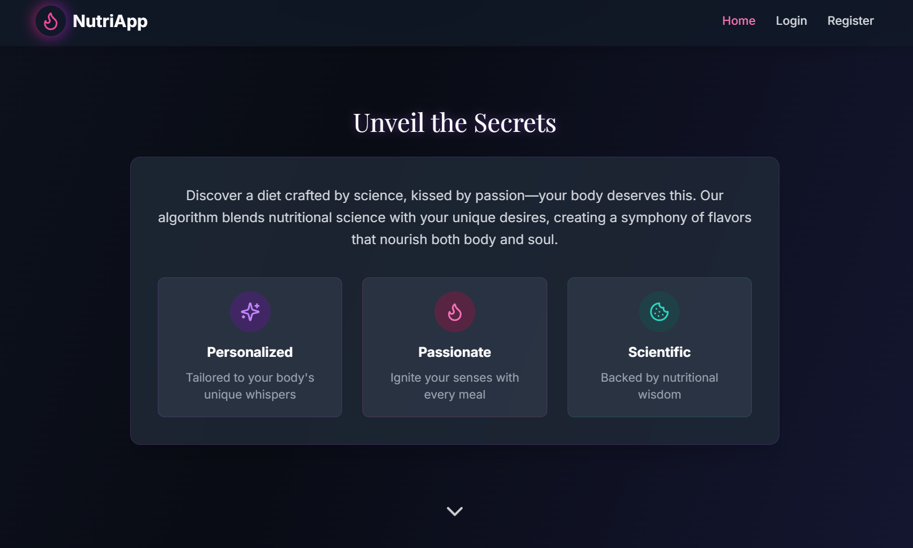
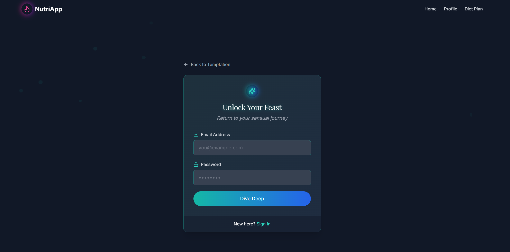
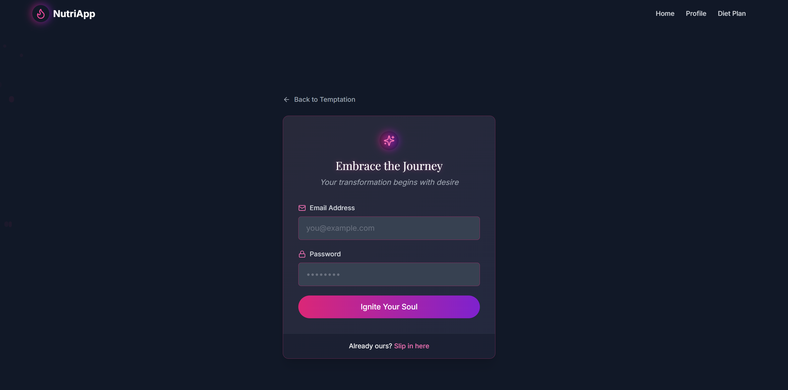
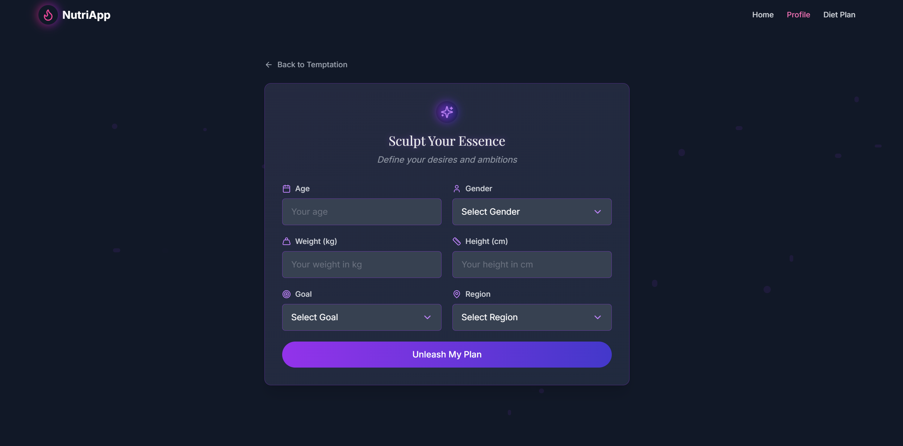

# NutriApp: Savor Your Destiny

  
*“In every bite, a whisper of eternity—nourish your soul.”*

Welcome to **NutriApp**, a seductive fusion of science and allure that crafts personalized diet plans tailored to your goals, budget, and regional flavors. This isn’t just an app—it’s a journey into a world where nutrition meets temptation, powered by cutting-edge tech and wrapped in a breathtakingly sexy UI.

Dive into a cosmic dark theme, glowing gradients, and a visionary experience that makes planning your diet feel like a ritual of self-love. Whether you’re shedding weight, building muscle, or embracing vitality, NutriApp is your sultry companion.

---

##  Features That Ignite Your Senses

- **Personalized Diet Plans**: Daily and weekly suggestions based on your age, gender, weight, height, goals, and region—delivered with irresistible flair.
- **Live Market Magic**: Mock veggie prices (expandable to real APIs like Agmarknet) ensure your plan fits your wallet.
- **Seductive Meal Display**: Feast your eyes on stunning food cards with images, calories, and costs—each bite a visual delight.
- **Philosophical Touch**: Inspirational lines like “Savor slowly, live deeply” elevate your experience.
- **Sexy Food Grid**: A homepage showcase of delicious items—vibrant, clickable, and dripping with allure.
- **Know More & Contact**: Informative sections to explore the science and reach out with a whisper.
- **Smooth Navigation**: A sticky navbar guides you through Home, Contact, Know More, Profile, and Diet Plan.
- **Dark Cosmic UI**: Gradients, glowing borders, and animations that pulse with every interaction.

---

##  Tech Stack: The Backbone of Brilliance

| **Layer**       | **Technologies**                       |
|------------------|----------------------------------------|
| **Frontend**    | React, Tailwind CSS, Axios, React Router DOM |
| **Backend**     | Node.js, Express.js, MongoDB, JWT      |
| **ML Model**    | Python, FastAPI, Pandas                |
| **Deployment**  | Local (Docker-ready for future scaling) |

---

##  Installation: Unleash the Feast

### Prerequisites
- **Node.js** (v20.11.0 or later)
- **MongoDB** (Community Server)
- **Python** (3.8+)
- Git (optional, for cloning)

### Steps
1. **Clone the Repository** (if hosted on GitHub):
   ```bash
   git clone https://github.com/plawangshishugit/nutriapp.git
   cd nutriapp
   ```

2. **Backend Setup**:
   ```bash
   cd server
   npm install
   node index.js
   ```
   - Ensure MongoDB is running (`mongod` in a separate terminal).

3. **ML Model Setup**:
   ```bash
   cd ml-model
   pip install fastapi uvicorn pandas
   uvicorn main:app --reload --port 8000
   ```

4. **Frontend Setup**:
   ```bash
   cd client
   npm install
   npm start
   ```
   - Opens `http://localhost:3000` in your browser.

5. **Explore**: Start at the homepage and let the seduction begin!

---

##  Usage: Craft Your Divine Feast

1. **Home**: Gaze at the food grid, ponder the philosophy, or contact us.
2. **Register**: Join with an email and password—ignite your journey.
3. **Login**: Dive back in and let your destiny unfold.
4. **Profile Setup**: Sculpt your essence with personal details.
5. **Diet Plan**: Savor a personalized plan with sexy food cards and totals.
6. **Logout**: Escape when you’re ready, only to return for more.

---

##  Screenshots: A Taste of Temptation

| **Page**          | **Preview**                                                                 |
|-------------------|-----------------------------------------------------------------------------|
| **Homepage**      |    |
| **Register**      |  |
| **Diet Plan**     |     |

---

##  Vision: Beyond Nutrition

NutriApp isn’t just about food—it’s about transforming how you connect with your body. Future enhancements could include:
- **Live API Integration**: Real-time veggie prices from Agmarknet or BigBasket.
- **AI-Powered Tips**: Seductive nutritional advice tailored to your plan.
- **Community Feast**: Share your plans with a sultry social twist.
- **AR Mode**: Visualize your meals in augmented reality (a visionary leap!).

---

##  Contributing: Whisper Your Ideas

Love NutriApp? Fork the repo, tweak the code, and submit a pull request. Let’s craft something irresistible together.

---

## 📬 Contact: Reach Out in Style

- **Email**: shishuplawang@gmail.com
- **GitHub**: [plawangshishugit](https://github.com/plawangshishugit)

---

*“Step into the banquet of your soul—NutriApp awaits.”*

---
